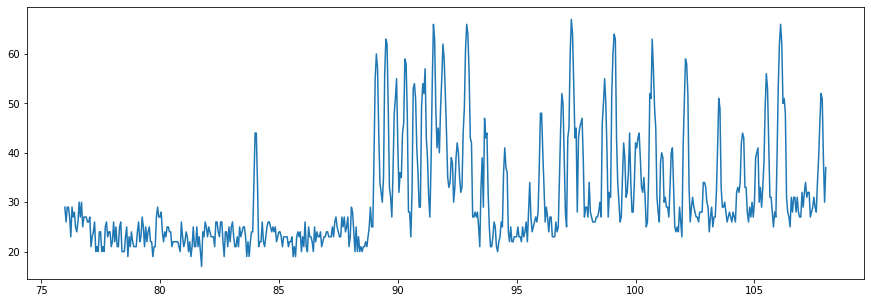

# Si4713 Functional Test 
- https://www.silabs.com/documents/public/data-sheets/Si4712-13-B30.pdf
- https://github.com/adafruit/Adafruit_CircuitPython_SI4713
- https://cdn-shop.adafruit.com/datasheets/SiLabs+Programming+guide+AN332.pdf


```python
import os, sys

def gen_relative_path(target_path): 
    
    def del_same_parents(target_path, current_path):
        if len(target_path) * len(current_path) > 0:
            if target_path[0] == current_path[0]:
                target_path.pop(0)
                current_path.pop(0)
                del_same_parents(target_path, current_path)
            
    current_path = os.getcwd().replace('\\', '/').split('/')
    target_path = target_path.replace('\\', '/').split('/')
    del_same_parents(target_path, current_path)
    
    return ['..'] * len(current_path) + target_path


def append_source_relative_path(source_relative_path):
    sys.path.append(os.sep.join(source_relative_path))
```


```python
# paths = [' ']
# paths = [gen_relative_path(p) for p in paths]
# print(paths)
```


```python
paths =[['..', '..', '..', '..', '..', 'Signal Generators', 'bitbucket', 'github', 'codes'],
        ['..', '..', '..', '..', '..', 'FX2LP', 'bitbucket', 'github', 'codes'], 
        ['..', '..', '..', '..', '..', 'Utilities', 'bitbucket', 'github', 'codes'],
        ['..', '..', 'codes']]

for path in paths:
    append_source_relative_path(path)
```


```python
%pylab inline
 
from array import array
from utilities.adapters import peripherals
from fm_transceivers.si47xx import Si4713
import fx2lp
```

    Populating the interactive namespace from numpy and matplotlib
    

## Generators

## Debug mode?


```python
cls = Si4713

cls.DEBUG_MODE_SHOW_BUS_DATA = False         # whether to show bus data. 
cls.DEBUG_MODE_PRINT_REGISTER = False        # whether to print registers. 
```

## Generators


```python
with_hardware_device = False

if with_hardware_device:
    _i2c = peripherals.I2C.get_Ftdi_i2c() 
    
else:
    _i2c =  None  # using None for testing without actual hardware device.

    
bus = peripherals.I2C(_i2c)
```

    
    ****** Virtual device. Data may not be real ! ******
    
    


```python
bus = fx2lp.I2C(as_400KHz = True)
pin_reset = fx2lp.GPIO().Pin(id = 1, mode = fx2lp.Pin.OUT, value = 1)
```


```python
freq = 88.80e6

si = Si4713(bus, pin_reset = pin_reset, freq = freq)
si.start()
```

## Noise Level Measurement


```python
plt.figure(figsize = (15, 5))
 
noise_levels = si.scan_noise_levels()
nl = np.array(noise_levels).T
plt.plot(nl[0] / 1e6, nl[1]);
```





```python
noise_levels_sorted = sorted(noise_levels, key = lambda x: x[1])
noise_levels_sorted[:30]
```


    [(81750000, 17),
     (78650000, 19),
     (79700000, 19),
     (81300000, 19),
     (82700000, 19),
     (83650000, 19),
     (83750000, 19),
     (85600000, 19),
     (85700000, 19),
     (77300000, 20),
     (77400000, 20),
     (77550000, 20),
     (77650000, 20),
     (78400000, 20),
     (78450000, 20),
     (78500000, 20),
     (80850000, 20),
     (81200000, 20),
     (81700000, 20),
     (85950000, 20),
     (86200000, 20),
     (86450000, 20),
     (88200000, 20),
     (88300000, 20),
     (88400000, 20),
     (88500000, 20),
     (94200000, 20),
     (77100000, 21),
     (77350000, 21),
     (77600000, 21)]


## RDS


```python
si.set_rds(program_id = 0x0520,
           station_name = "Wei Lin",
           radio_text = "My Radio Station !",
           program_type_code = 4,
           repeat_count = 3, message_count = 1, rds_mix_ratio = 50,  
           rds_fifo_size = 20,
           enable = True)
```


```python
# while True:
#     si.set_rds_buffer(message = time.strftime("%Y-%m-%d %H:%M:%S"), use_FIFO = True)
#     time.sleep(10)
```


```python
si.set_rds(enable = False)
```

## Member functions test


```python
# for f in dir(Si4713):
#     if not f.startswith('_'):
#         if f.islower():
#             if callable(getattr(Si4713, f)):
#                 print('si.{}()'.format(f))
```


```python
# si.apply_signal()
```


```python
si.close()
```


```python
si.enable(False)
```


```python
si.enable(True)
```


```python
si.enable_output(False)
```


```python
si.enable_output(True)
```


```python
# si.enable_output_channel(0)
```


```python
# si.load_registers()
```


```python
si.mute(True)
```


```python
si.mute(False)
```


```python
si.mute_line_input(True)
```


```python
si.mute_line_input(False)
```


```python
si.pause()
```


```python
si.resume()
```


```python
si.power_down()
```


```python
si.power_up()
```


```python
si.reset()
```


```python
si.init()
```


```python
# si.select_freq_source(0)
```


```python
# si.select_phase_source(0)
```


```python
si.set_frequency(88.8e6)
```


```python
si.set_gpio_direction()
```


```python
si.set_gpio_level()
```


```python
# si.set_phase(0)
```


```python
si.set_power(115)
```


```python
si.stop()
```


```python
si.start()
```


```python
si.update()
```


```python
si.read_all_registers()
```


    [(1, 'GPO_IEN', 199),
     (257, 'DIGITAL_INPUT_FORMAT', 0),
     (259, 'DIGITAL_INPUT_SAMPLE_RATE', 0),
     (513, 'REFCLK_FREQ', 32768),
     (514, 'REFCLK_PRESCALE', 0),
     (8448, 'TX_COMPONENT_ENABLE', 3),
     (8449, 'TX_AUDIO_DEVIATION', 6625),
     (8450, 'TX_PILOT_DEVIATION', 675),
     (8451, 'TX_RDS_DEVIATION', 0),
     (8452, 'TX_LINE_INPUT_LEVEL', 190),
     (8453, 'TX_LINE_INPUT_MUTE', 0),
     (8454, 'TX_PREEMPHASIS', 0),
     (8455, 'TX_PILOT_FREQUENCY', 19000),
     (8704, 'TX_ACOMP_ENABLE', 3),
     (8705, 'TX_ACOMP_THRESHOLD', 65496),
     (8706, 'TX_ACOMP_ATTACK_TIME', 2),
     (8707, 'TX_ACOMP_RELEASE_TIME', 4),
     (8708, 'TX_ACOMP_GAIN', 15),
     (8709, 'TX_LIMITER_RELEASE_TIME', 13),
     (8960, 'TX_ASQ_INTERRUPT_SELECT', 7),
     (8961, 'TX_ASQ_LEVEL_LOW', 206),
     (8962, 'TX_ASQ_DURATION_LOW', 10000),
     (8963, 'TX_ASQ_LEVEL_HIGH', 236),
     (8964, 'TX_ASQ_DURATION_HIGH', 5000),
     (11264, 'TX_RDS_INTERRUPT_SOURCE', 0),
     (11265, 'TX_RDS_PI', 0),
     (11266, 'TX_RDS_PS_MIX', 0),
     (11267, 'TX_RDS_PS_MISC', 0),
     (11268, 'TX_RDS_PS_REPEAT_COUNT', 0),
     (11269, 'TX_RDS_PS_MESSAGE_COUNT', 0),
     (11270, 'TX_RDS_PS_AF', 0),
     (11271, 'TX_RDS_FIFO_SIZE', 0)]


```python
si.write_all_registers()
```


```python
si.print()
```

    
    << GPO_IEN >>     :  ('0xc7', '0b11000111')
    [ Reserved_11 ] :  0
    [ RDSREP ]      :  0
    [ ASQREP ]      :  0
    [ STCREP ]      :  0
    [ CTSIEN ]      :  1
    [ ERRIEN ]      :  1
    [ Reserved_3 ]  :  0
    [ RDSIEN ]      :  1
    [ ASQIEN ]      :  1
    [ STCIEN ]      :  1
    
    << DIGITAL_INPUT_FORMAT >>:  ('0x0', '0b0')
    [ Reserved_8 ] :  0
    [ IFALL ]      :  0
    [ IMODE ]      :  0
    [ IMONO ]      :  0
    [ ISIZE ]      :  0
    
    << DIGITAL_INPUT_SAMPLE_RATE >>:  ('0x0', '0b0')
    [ DISR ] :  0
    
    << REFCLK_FREQ >>:  ('0x8000', '0b1000000000000000')
    [ REFCLKF ] :  32768
    
    << REFCLK_PRESCALE >>:  ('0x0', '0b0')
    [ Reserved_13 ] :  0
    [ RCLKSEL ]     :  0
    [ REFCLKP ]     :  0
    
    << TX_COMPONENT_ENABLE >>:  ('0x3', '0b11')
    [ Reserved_3 ] :  0
    [ RDS ]        :  0
    [ LMR ]        :  1
    [ PILOT ]      :  1
    
    << TX_AUDIO_DEVIATION >>:  ('0x19e1', '0b1100111100001')
    [ TXADEV ] :  6625
    
    << TX_PILOT_DEVIATION >>:  ('0x2a3', '0b1010100011')
    [ TXPDEV ] :  675
    
    << TX_RDS_DEVIATION >>:  ('0x0', '0b0')
    [ TXRDEV ] :  0
    
    << TX_LINE_INPUT_LEVEL >>:  ('0xbe', '0b10111110')
    [ Reserved_14 ] :  0
    [ LIATTEN ]     :  0
    [ Reserved_10 ] :  0
    [ LILEVEL ]     :  190
    
    << TX_LINE_INPUT_MUTE >>:  ('0x0', '0b0')
    [ Reserved_2 ] :  0
    [ LIMUTE ]     :  0
    [ RIMUTE ]     :  0
    
    << TX_PREEMPHASIS >>:  ('0x0', '0b0')
    [ Reserved_2 ] :  0
    [ FMPE ]       :  0
    
    << TX_PILOT_FREQUENCY >>:  ('0x4a38', '0b100101000111000')
    [ FREQ ] :  19000
    
    << TX_ACOMP_ENABLE >>:  ('0x3', '0b11')
    [ Reserved_2 ] :  0
    [ LIMITEN ]    :  1
    [ ACEN ]       :  1
    
    << TX_ACOMP_THRESHOLD >>:  ('0xffd8', '0b1111111111011000')
    [ THRESHOLD ] :  65496
    
    << TX_ACOMP_ATTACK_TIME >>:  ('0x2', '0b10')
    [ Reserved_4 ] :  0
    [ ATTACK ]     :  2
    
    << TX_ACOMP_RELEASE_TIME >>:  ('0x4', '0b100')
    [ Reserved_3 ] :  0
    [ RELEASE ]    :  4
    
    << TX_ACOMP_GAIN >>:  ('0xf', '0b1111')
    [ Reserved_6 ] :  0
    [ GAIN ]       :  15
    
    << TX_LIMITER_RELEASE_TIME >>:  ('0xd', '0b1101')
    [ LMITERTC ] :  13
    
    << TX_ASQ_INTERRUPT_SELECT >>:  ('0x7', '0b111')
    [ Reserved_3 ] :  0
    [ OVERMODIEN ] :  1
    [ IALHIEN ]    :  1
    [ IALLIEN ]    :  1
    
    << TX_ASQ_LEVEL_LOW >>:  ('0xce', '0b11001110')
    [ Reserved_8 ] :  0
    [ IALLTH ]     :  206
    
    << TX_ASQ_DURATION_LOW >>:  ('0x2710', '0b10011100010000')
    [ IALLDUR ] :  10000
    
    << TX_ASQ_LEVEL_HIGH >>:  ('0xec', '0b11101100')
    [ Reserved_8 ] :  0
    [ IALHTH ]     :  236
    
    << TX_ASQ_DURATION_HIGH >>:  ('0x1388', '0b1001110001000')
    [ IALHDUR ] :  5000
    
    << TX_RDS_INTERRUPT_SOURCE >>:  ('0x0', '0b0')
    [ RDSPSXMIT ]   :  0
    [ RDSCBUFXMIT ] :  0
    [ RDSFIFOXMIT ] :  0
    [ RDSCBUFWRAP ] :  0
    [ RDSFIFOMT ]   :  0
    
    << TX_RDS_PI >>:  ('0x0', '0b0')
    [ RDSPI ] :  0
    
    << TX_RDS_PS_MIX >>:  ('0x0', '0b0')
    [ Reserved_3 ] :  0
    [ RDSPSMIX ]   :  0
    
    << TX_RDS_PS_MISC >>:  ('0x0', '0b0')
    [ RDSD3 ]      :  0
    [ RDSD2 ]      :  0
    [ RDSD1 ]      :  0
    [ RDSD0 ]      :  0
    [ FORCEB ]     :  0
    [ RDSTP ]      :  0
    [ RDSPTY ]     :  0
    [ RDSTA ]      :  0
    [ RDSMS ]      :  0
    [ Reserved_0 ] :  0
    
    << TX_RDS_PS_REPEAT_COUNT >>:  ('0x0', '0b0')
    [ Reserved_8 ] :  0
    [ RDSPSRC ]    :  0
    
    << TX_RDS_PS_MESSAGE_COUNT >>:  ('0x0', '0b0')
    [ Reserved_4 ] :  0
    [ RDSPSMC ]    :  0
    
    << TX_RDS_PS_AF >>:  ('0x0', '0b0')
    [ RDSAF ] :  0
    
    << TX_RDS_FIFO_SIZE >>:  ('0x0', '0b0')
    [ Reserved_8 ] :  0
    [ RDSFIFOSZ ]  :  0
    
